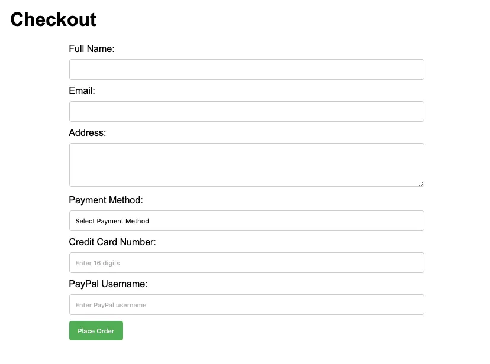

- - -

## Preparation

Create a folder in your editor. Inside of that folder create four files.

1. form-demo.html
2. form-demo.js
3. completed.html
4. form-demo.css

Copy and paste the code below into the appropriate file.

### form-demo.html

```html
<!-- form-demo.html -->
<!DOCTYPE html>
<html lang="en">
  <head>
    <meta charset="UTF-8" />
    <meta name="viewport" content="width=device-width, initial-scale=1.0" />
    <title>Checkout Form</title>
    <link rel="stylesheet" href="form-demo.css" />
    <script src="form-demo.js" defer></script>
  </head>
  <body>
    <header><h1>Checkout</h1></header>
    <main>
      <section class="errors"></section>
      <form id="checkoutForm" action="completed.html"></form>
    </main>
  </body>
</html>
```

### Javascript

```javascript
// form-demo.js

function togglePaymentDetails() {
  
  // Get a reference to the creditCardContainer and paypalUsernameContainer
  const creditCardContainer = ;
  const paypalContainer = ;

  // Show the container based on the selected payment method and hide the other container, and add the required attribute to the one selected and take off the required from the one not selected.


}


// attach a change event handler to the paymentMethod input

// get a reference to the form. We can access all the name form inputs throughthe form element.

//Initially set both credit card and paypal inputs to not required since they are both hidden to begin with and this will prevent errors

```

### completed.html

```html
<!-- completed.html -->
<!DOCTYPE html>
<html lang="en">
  <head>
    <meta charset="UTF-8" />
    <meta name="viewport" content="width=device-width, initial-scale=1.0" />
    <title>Order Complete</title>
    <link rel="stylesheet" href="form-demo.css" />
  </head>
  <body>
    <h2>Thank you for your order!</h2>
  </body>
</html>
```

### form-demo.css

```css
/* form-demo.css */
* {
    box-sizing: border-box;
  }
  body {
    font-family: Arial, sans-serif;
    margin: 20px;
  }
  
  main {
    max-width: 600px;
    margin: 0 auto;
  }
  
  .errors > p {
    border: 1px solid red;
    padding: 0.5em;
  }
  /* Style the select arrow for Safari */
  select::-webkit-inner-spin-button,
  select::-webkit-outer-spin-button {
    -webkit-appearance: none;
    margin: 0;
  }
  
  /* Style the select arrow for other browsers */
  select {
    -moz-appearance: none;
    -webkit-appearance: none;
    appearance: none;
  }
  
  .hide {
    display: none; /* Initially hide the credit card input and label */
  }

  label {
    display: block;
    margin-bottom: 8px;
  }
  
  input,
  select,
  textarea {
    width: 100%;
    padding: 10px;
    margin-bottom: 10px;
    box-sizing: border-box;
    border: 1px solid #ccc; /* Add a border to make it visually consistent */
    border-radius: 4px;
  }
  button {
    background-color: #4caf50;
    color: white;
    padding: 10px 15px;
    border: none;
    border-radius: 4px;
    cursor: pointer;
  }
```
You will see some errors in the JavaScript until we complete the code there.

These activities will be most effective if you TRY them first before you look at the solution. And after you do look at the solution...DO NOT copy and paste the code. Read through it, try to understand what it is doing...then go fix your code.

## Activity 1

The first thing we need to do is to build out our form in HTML. We should also take advantage of the built in HTML validation.

1. Open the form-demo.html file you were provided. Review the mockup below and create the form it shows.



2. Make sure to have a label for each element as well as adding a name and id to each. Finally make each of the form inputs required.
3. Credit card numbers are always 16 digits. We can use a pattern to make sure the value entered it exactly 16 digits. Add pattern="[0-9]{16}" to the input for the creditcard number

<div class="callout">
    The [0-9]{16} is a simple Regular Expression. The first part: [0-9] means that only the characters 0-9 are allowed. The second part: {16} means we should have 16 of them.
</div>

4. Initially we don't want to see the credit card number or Paypay username inputs. Use the .hide class to hide them.
5. Finally open up style.css and add the css necessary to make your form look like the mockup. You will notice that you have been given some CSS. Part of that is to handle styling of the select elements in the different browsers...selects can be stubborn.


<details>
<summary>Solution 1</summary>

```html
<form id="checkoutForm" action="completed.html">
  <label for="fullName">Full Name:</label>
  <input type="text" id="fullName" name="fullName" required />

  <label for="email">Email:</label>
  <input type="email" id="email" name="email" required />

  <label for="address">Address:</label>
  <textarea id="address" name="address" rows="4" required></textarea>

  <label for="paymentMethod">Payment Method:</label>
  <select id="paymentMethod" name="paymentMethod" required>
    <option value="">Select Payment Method</option>
    <option value="creditCard">Credit Card</option>
    <option value="paypal">PayPal</option>
  </select>

  <!-- Container for credit card details -->
  <p id="creditCardNumberContainer" class="hide">
    <label for="creditCardNumber">Credit Card Number:</label>
    <input
      type="text"
      id="creditCardNumber"
      name="creditCardNumber"
      pattern="[0-9]{16}"
      placeholder="Enter 16 digits"
      required
    />
  </p>

  <!-- Container for PayPal details -->
  <p id="paypalUsernameContainer" class="hide">
    <label for="paypalUsername">PayPal Username:</label>
    <input
      type="text"
      id="paypalUsername"
      name="paypalUsername"
      placeholder="Enter PayPal username"
      required
    />
  </p>

  <button type="submit">Place Order</button>
</form>
```

If you are looking at those <p> tags being used to group up the labels and inputs and wondering why I didn't just use a <div>, it's partly a matter of preference, but partly because of the definition of a p element from MDN: "Paragraphs are usually represented in visual media as blocks of text separated from adjacent blocks by blank lines and/or first-line indentation, but HTML paragraphs can be any structural grouping of related content, such as images or form fields."

```css
/* form-demo.css */

label {
  display: block;
  margin-bottom: 8px;
}

input,
select,
textarea {
  width: 100%;
  padding: 10px;
  margin-bottom: 10px;
  box-sizing: border-box;
  border: 1px solid #ccc; /* Add a border to make it visually consistent */
  border-radius: 4px;
}
button {
  background-color: #4caf50;
  color: white;
  padding: 10px 15px;
  border: none;
  border-radius: 4px;
  cursor: pointer;
}
```
</details>

## Activity 2

If you try submitting the form you will see that it prompts us to fill in all of the required elements before it will proceed. However, if you fill it all out and submit we get an error. We currently have 2 hidden required fields. The browser considers this an error...as it should. We need to add some Javascript to first hide and show the appropriate fields, and remove the required attribute from the one that stays hidden.

Open the form-demo.js file. It contains several incomplete functions. Start with the togglePaymentDetails function. Follow the comments to complete it.

Here are a few tips:

1. You can add and remove classes to elements through element.classList.add("classname") and element.classList.remove("classname")
2. required is a bit of a funny attribute since it doesn't have a value. You can actually remove it by doing element.required = false or by using element.removeAttribute("required"). You can add it back with either element.required = true or element.setAttribute("required", "")
3. Remember that when working with form inputs the stuff typed into the input can be found in element.value

One you have finished writing the function, add a change event listener to the paymentMethod form input that will call our togglePaymentDetails function on change.

<details>
<summary>Solution 1</summary>
```javascript
// form-demo.js
  
function togglePaymentDetails() {

// Get a reference to the creditCardContainer and paypalContainer
const creditCardContainer = document.querySelector('#creditCardNumberContainer');
const paypalContainer = document.querySelector('#paypalUsernameContainer');

// Show the container based on the selected payment method and hide the other container, and add the required attribute to the one selected and take off the required from the one not selected.

    if (theForm.paymentMethod.value === 'creditCard'){
        creditCardContainer.classList.remove('hide');
        paypalContainer.classList.add('hide');
        theForm.paypalUsername.required = false;
        theForm.creditCardNumber.required = true;
    } else if (theForm.paymentMethod.value === 'paypal') {
        paypalContainer.classList.remove('hide');
        creditCardContainer.classList.add('hide');
        theForm.creditCardNumber.required = false;
        theForm.paypalUsername.required = true
    }

}

// attach a change event handler to the paymentMethod input
let payment_option = document.querySelector('#paymentMethod');
payment_option.addEventListener('change', togglePaymentDetails)

// get a reference to the form. We can access all the named form inputs through the form element.
const theForm = document.querySelector('form');

//Initially set both credit card and paypal inputs to not required since they are both hidden to begin with and this will prevent errors
theForm.paypalUsername.required = false;
theForm.creditCardNumber.required = false;
```
</details>